# Waste Classification Using CNN with Transfer Learning

A deep learning project that classifies different types of waste materials using Convolutional Neural Networks (CNN) with Transfer Learning approach based on MobileNetV2 architecture.

## 🎯 Project Overview

This project implements an automated waste classification system that can identify and categorize 17 different types of waste materials. The model uses transfer learning with MobileNetV2 as the base architecture, achieving efficient and accurate classification for waste management applications.

## 📊 Dataset

- **Total Classes**: 17 different waste categories
- **Dataset Structure**: Organized in folders by class
- **Data Split**: 80% Training, 10% Validation, 10% Testing
- **Data Balancing**: Applied undersampling and data augmentation techniques
- **Target Images per Class**: 400 images (balanced dataset)

### Data Preprocessing Pipeline

1. **Exploratory Data Analysis (EDA)**: Analyzed class distribution and dataset statistics
2. **Data Balancing**: 
   - Undersampling for classes with >400 images
   - Data augmentation for classes with <400 images
3. **Data Augmentation Parameters**:
   - Rotation: ±20 degrees
   - Width/Height shift: ±20%
   - Shear range: 20%
   - Zoom range: 20%
   - Horizontal flip: Enabled

## 🏗️ Model Architecture

### Base Model: MobileNetV2
- **Input Shape**: (224, 224, 3)
- **Pre-trained Weights**: ImageNet
- **Transfer Learning**: Base model frozen during initial training

### Custom Classification Head
```
MobileNetV2 (frozen) → GlobalAveragePooling2D → Dense(128, relu) → Dense(17, softmax)
```

### Architecture Diagram

```mermaid
graph TD
    A[Input Image<br/>224×224×3] --> B[MobileNetV2<br/>Pre-trained ImageNet<br/>Frozen Layers]
    B --> C[GlobalAveragePooling2D<br/>Feature Extraction]
    C --> D[Dense Layer<br/>128 neurons, ReLU]
    D --> E[Output Layer<br/>17 classes, Softmax]
    E --> F[Waste Category<br/>Prediction]
```


### Model Configuration
- **Optimizer**: Adam (learning_rate=0.0001)
- **Loss Function**: Categorical Crossentropy
- **Metrics**: Accuracy
- **Batch Size**: 32
- **Training Epochs**: 10
- **Image Size**: 224×224 pixels

## 🛠️ Technologies Used

- **Deep Learning Framework**: TensorFlow/Keras
- **Data Processing**: pandas, numpy
- **Visualization**: matplotlib, seaborn, plotly
- **Image Processing**: PIL (Python Imaging Library)
- **Data Augmentation**: ImageDataGenerator
- **Model Evaluation**: sklearn.metrics
- **Additional Tools**: splitfolders

## 📁 Project Structure

```
Waste_Classification_CNN/
├── dataset/
│   ├── garbage_images/          # Original dataset
│   └── balanced_waste_images/   # Balanced dataset
├── imgs/
│   ├── train/                   # Training data (80%)
│   ├── val/                     # Validation data (10%)
│   └── test/                    # Test data (10%)
├── ModelTraining.ipynb          # Main training notebook
├── WasteClassification_model.h5 # Trained Keras model
├── WasteClassification_model.tflite # TensorFlow Lite model
├── requirements.txt             # Dependencies
└── README.md
```

## 🚀 Getting Started

### Prerequisites

```bash
pip install -r requirements.txt
```

### Installation

1. Clone the repository:
```bash
git clone https://github.com/KaanCL/Waste_Classification_CNN.git
cd Waste_Classification_CNN
```

2. Install required dependencies:
```bash
pip install -r requirements.txt
```

3. Run the Jupyter notebook:
```bash
jupyter notebook ModelTraining.ipynb
```

## 📈 Model Performance

The model achieves efficient classification across 17 waste categories using transfer learning approach. Detailed performance metrics including accuracy, precision, recall, and F1-score can be found in the training notebook.

## 🔧 Key Features

- **Transfer Learning**: Leverages pre-trained MobileNetV2 for efficient training
- **Data Balancing**: Automatic handling of imbalanced datasets
- **Mobile-Friendly**: TensorFlow Lite model for mobile deployment
- **Comprehensive EDA**: Detailed dataset analysis and visualization
- **Flexible Architecture**: Easy to modify for different numbers of classes

## 🎯 Applications

- **Smart Waste Management Systems**
- **Recycling Automation**
- **Environmental Monitoring**
- **Mobile Waste Classification Apps**
- **Industrial Waste Sorting**

## 👤 Author

**Kaan CL**
- GitHub: [@KaanCL](https://github.com/KaanCL)

---

**Note**: This project demonstrates the practical application of transfer learning for environmental sustainability through automated waste classification.
